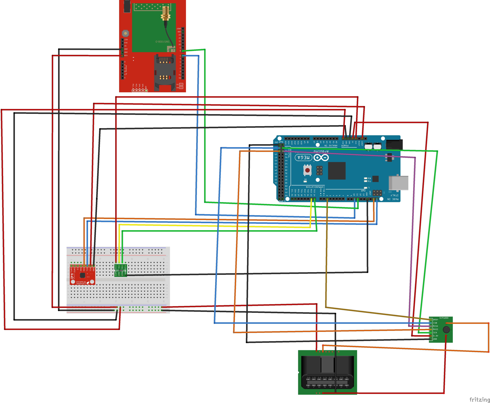

# Redrive OBD module
Stand-alone Arduino based OBD device, which communicates with a MQTT broker over 3G communication

## Listener client
https://github.com/orei30/Redrive-mqtt-client

## Circuit

